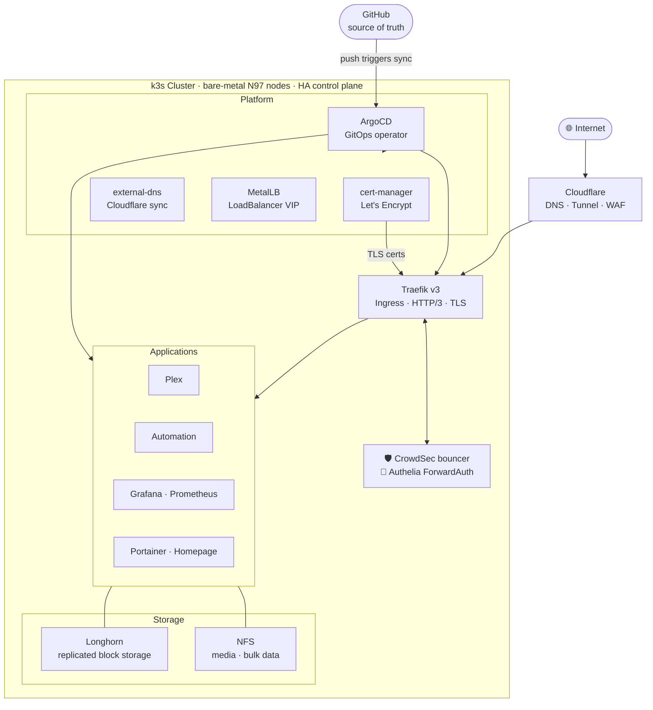

# homelab-infra

GitOps configuration for a self-hosted bare-metal Kubernetes cluster. Everything is declarative — if it's not in git, it doesn't exist.

## Architecture



## Stack

### Infrastructure

- **[k3s](https://k3s.io)** — lightweight Kubernetes on bare-metal Intel N97 mini PCs; HA control plane survives a node failure
- **[Traefik v3](https://traefik.io)** — ingress controller with HTTP/3, TLS termination, and global middleware; 3 replicas, non-root, read-only root filesystem
- **[ArgoCD](https://argoproj.github.io/cd)** — GitOps operator with `selfHeal` + `prune`; drift is corrected automatically within minutes
- **[MetalLB](https://metallb.io)** — layer 2 load balancer, assigns a stable VIP to Traefik on the LAN
- **[cert-manager](https://cert-manager.io)** — automates Let's Encrypt issuance via Cloudflare DNS-01; no manual cert work
- **[external-dns](https://github.com/kubernetes-sigs/external-dns)** — watches Ingress resources and creates/removes Cloudflare DNS records automatically
- **[Cloudflare Tunnel](https://developers.cloudflare.com/cloudflare-one/connections/connect-networks)** — zero-trust ingress; no ports exposed on the home router

### Security

- **[CrowdSec](https://crowdsec.net)** — IPS running as a DaemonSet; agents parse Traefik access logs, bouncer plugin blocks banned IPs at the edge before requests reach any service; community blocklist covers tens of thousands of known-bad IPs
- **[Authelia](https://authelia.com)** — SSO and ForwardAuth; all internal services authenticate through Authelia at the Traefik layer
- **[Gitleaks](https://github.com/gitleaks/gitleaks)** — pre-commit hook; credentials committed to git are rejected immediately

### Storage & Observability

- **[Longhorn](https://longhorn.io)** — distributed block storage with cross-node replication; a disk failure doesn't take down a service
- **[kube-prometheus-stack](https://github.com/prometheus-community/helm-charts/tree/main/charts/kube-prometheus-stack)** — Prometheus + Grafana scraping node, pod, and application metrics; dashboards for cluster health, Traefik request rates, and CrowdSec detections
- **[Homepage](https://gethomepage.dev)** — start-page dashboard with live pod status and widget integrations for all services
- **[Portainer](https://portainer.io)** — cluster inspection UI; ArgoCD owns desired state, Portainer is for observation and manual intervention

## Principles

**Everything in git.** Every namespace, application, certificate, and ingress route is a YAML file here. ArgoCD reconciles the cluster to match.

**Secrets never in git.** Gitleaks blocks credential commits pre-push. Secrets are created manually in the cluster or managed via 1Password Connect.

**Defense in depth.** CrowdSec blocks known-bad IPs at the edge. Authelia handles authentication. Services only see clean, authed traffic.

**Self-healing.** ArgoCD with `selfHeal: true` corrects any drift. Accidentally delete a resource — it comes back. Edit something manually — it gets reverted.

## Hardware

| | |
|---|---|
| **Nodes** | Intel N97 mini PCs — low power, fanless, surprisingly capable |
| **NAS** | Unraid with parity-protected drives; NFS for media and bulk storage |
| **Network** | UniFi — cluster nodes on a dedicated VLAN; all external traffic through Cloudflare Tunnel |

## Repository Layout

```
infra/
├── argocd/             # ArgoCD's own ingress and server config
├── authelia/           # SSO / ForwardAuth
├── cert-manager/       # TLS automation
├── cloudflare-tunnel/  # Zero Trust ingress
├── crowdsec/           # IPS agents + LAPI
├── dashboard/          # Homepage dashboard
├── longhorn/           # Block storage
├── metallb/            # LoadBalancer VIP pool
├── monitoring/         # Prometheus + Grafana + Alertmanager
└── portainer/          # Cluster management UI
```

Each app follows the same pattern:
- `argocd/<app>-application.yaml` — ArgoCD `Application` manifest
- `k8s/` — Kubernetes manifests (Kustomize); synced by ArgoCD from this repo

**`Application` manifests are not self-managed.** ArgoCD reconciles the resources *inside* an app, but it reads each app's own spec from the live `Application` object in the cluster. Editing a file under `argocd/` and pushing changes nothing until it is applied:

```bash
kubectl apply -f <app>/argocd/<app>-application.yaml
```

Traefik and external-dns live in their own repositories and are wired into the same ArgoCD instance.
