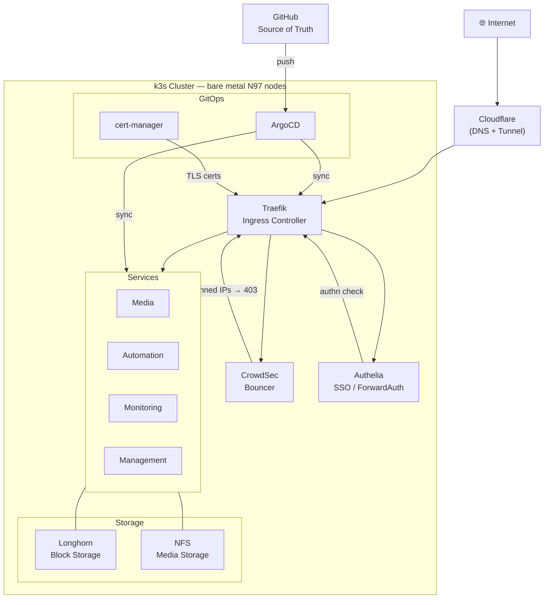

# agffa homelab

Self-hosted. GitOps. Always evolving.

A bare-metal Kubernetes cluster running on mini PCs, managed entirely through git. Every service, every config change, every secret rotation — declarative and version-controlled.

**k3s · high availability · GitOps via ArgoCD · active threat blocking**

---

## Architecture



---

## Stack

### Core Infrastructure

| Component | Role |
|-----------|------|
| **k3s** | Lightweight Kubernetes across bare-metal N97 mini PCs. HA control plane — cluster survives a node failure. |
| **Traefik** | Ingress controller with HTTP/3, automatic TLS, and global middleware. 3 replicas, non-root, read-only filesystem. |
| **ArgoCD** | Declarative GitOps operator. Every app points at a git path. `selfHeal` and `prune` keep cluster state honest. |
| **Cloudflare** | DNS and Zero Trust tunnel. External traffic enters through Cloudflare — no exposed ports on the home router. |
| **MetalLB** | Layer 2 load balancer — assigns a stable VIP to Traefik on the home network. |
| **cert-manager** | Automates Let's Encrypt certificate issuance via DNS-01 challenge through Cloudflare. |
| **external-dns** | Watches Ingress resources, automatically creates and removes DNS records in Cloudflare. |

### Security

| Component | Role |
|-----------|------|
| **CrowdSec** | Open-source IPS. Agents parse Traefik access logs; a bouncer plugin blocks banned IPs at the edge. Community blocklist covers tens of thousands of known-bad IPs. |
| **Authelia** | SSO via Traefik ForwardAuth. All internal services authenticate through Authelia — no per-app auth needed. |
| **Gitleaks** | Pre-commit hook scans every commit for hardcoded secrets. Credentials never touch git. |

### Storage & Observability

| Component | Role |
|-----------|------|
| **Longhorn** | Distributed block storage. Volumes replicated across nodes — a disk failure doesn't take down a service. |
| **NFS** | NAS-backed file storage for media and bulk data, mounted as PersistentVolumes. |
| **Prometheus + Grafana** | kube-prometheus-stack scrapes node, pod, and app metrics. Dashboards for cluster health, Traefik, and CrowdSec. |
| **Homepage** | Start-page dashboard with live pod status and widget integrations for every service. |
| **Portainer** | Cluster inspection UI. ArgoCD owns desired state; Portainer is for observation and manual ops. |

### Self-hosted Services

| Service | Description |
|---------|-------------|
| **Plex** | Media server streaming from NFS-backed storage. Hardware transcoding, accessible inside and outside the home network. |
| **n8n** | Workflow automation with PostgreSQL backend and external task runner for code nodes. |
| **Project Zomboid** | Containerised game server with RCON management and persistent world storage. |

---

## How it's run

**Everything in git** — No manual cluster state. Every application, namespace, certificate, and ingress route is a YAML file in this repo. If it's not in git, it doesn't exist.

**Secrets stay out of git** — A pre-commit Gitleaks scan rejects credentials at commit time. Secrets live in cluster-side Kubernetes Secrets only, created manually or via 1Password Connect.

**Self-healing cluster** — ArgoCD runs with `selfHeal` and `prune` enabled. Drift is corrected automatically. A deleted resource comes back; an accidental edit is reverted within minutes.

**Defense in depth** — Threats are blocked before they reach services. CrowdSec handles known-bad IPs at the ingress layer; Authelia handles authentication. Services see only clean, authed traffic.

---

## Hardware

| | |
|--|--|
| **k3s nodes** | Intel N97 mini PCs — low power, silent, and capable. |
| **NAS** | Unraid with drives in a parity-protected array. NFS shares for media and bulk storage. |
| **Network** | UniFi switches and APs. Cluster nodes on a dedicated VLAN. No ports forwarded — all ingress through Cloudflare tunnel. |

---

## Repository Layout

```
infra/
├── authelia/          # SSO
├── cert-manager/      # TLS automation
├── cloudflare-tunnel/ # Zero Trust ingress
├── crowdsec/          # IPS + bouncer
├── dashboard/         # Homepage config
├── external-dns/      # DNS automation
├── longhorn/          # Block storage
├── metallb/           # Load balancer
├── monitoring/        # Prometheus + Grafana
└── portainer/         # Cluster management UI
```

Each directory contains:
- `argocd/` — the ArgoCD `Application` manifest (applied with `kubectl apply`)
- `k8s/` — the actual Kubernetes manifests managed by that app
